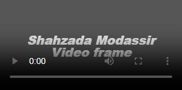

# Placeholder UI 
> A simple fast free user interface placeholder-ui plugin.


Placeholder UI is a `Image` or `Video` placeholder user interface plugin. Placeholder UI is one-dependency module `placeholder-ui` dependent on `Snizzle` CSS selector Javascript engine. Placeholder UI that set default placeholder of all elements `image/video` of empty src. Placehlder UI in multiple features available like background, text color, cutom text, size preview and more. 

[](https://www.npmjs.com/package/placeholder-ui)
[](https://github.com/jqrony/placeholder-ui/blob/main/LICENSE)
[](https://packagephobia.com/result?p=placeholder-ui)


- [🙏🏻 Follow on Github](https://github.com/jqrony)
- [🔖 Releases](https://github.com/jqrony/placeholder-ui/releases)
- [⬇️ Install](#-install)
- [📚 Examples](#-examples)
- [📖 Documentation](#-documentation)
- [🚀 CDN links](#-cdn)
- [🌐 Browsers support](#-browser)

## ⬇️ Install npm
```bash
# install locally (recommended)
npm install placeholder-ui --save
```

## Including Placeholder UI
Below are some of the most common ways to include placeholder-ui.

### Browser
### Script tag
```html
<!--Implement Snizzle CSS selector engine libraray in head section (Recomended)-->
<script src="https://cdn.jsdelivr.net/npm/snizzle/dist/snizzle-min.js"></script>

<!-- Implement placeholder-ui plugin from cdn link or your download destination -->
<script src="https://cdn.jsdelivr.net/npm/placeholder-ui/plugin/placeholder-ui-min.js"></script>
```

## 📖 Documentation
### Public API
**`placeholder(Object options)`**

***Parameters***
options: A placeholder Object `{}`

## 📚 Examples

#### HTML code
```html
<!-- for image placeholder required image in [data-sizes] attribute -->

<!-- for video placeholder required video in [data-text] attribute -->
<video src="" data-text="Example Text"></video>
```

#### Javascript code
```js
placeholder.set({
	background: "#677cbb",  // Placeholder background (optional)
	color: "#fff",          // Placholder text color (optional)
	sizePreview: true,      // true/false true for incling size preview (optinal)
	fontFamily: "Arial",    // Custom font-family (optinal)
	fontSize: 20,           // Custom font-size (optinal)
	fontWeight: 900,        // Custom font-weight (optinal)
	fontStyle: "normal"     // Custom font-style italic/oblique/normal (optinal)
});
```

## 🚀 CDN Links
- [Github link](https://jqrony.github.io/placeholder-ui/plugin/placeholder-ui-min.js)
- [CDN link](https://cdn.jsdelivr.net/npm/placeholder-ui/plugin/placeholder-ui-min.js)

## 🌐 Browsers support

### Desktop
- Chrome 16+
- Edge 12+
- Firefox 3.6+
- Internet Explorer 7+1
- Opera 11.6+
- Safari 4.0+

<sup>1</sup>Workarounds for Internet Explorer 6 are still in the code but the browser is no longer actively tested.

### Mobile
- Android 2.3+
- iOS 5.1+

To report a bug in any of these browsers, please <a href="https://github.com/jqrony/placeholder-ui/issues">add an issue</a> with a test case from <a href="https://jsbin.com">jsfiddle</a> or <a href="https://jsfiddle.net">jsbin</a>.

## Usage
**HTML Code**
```html

```
**Javascript Code**
```js
placeholder.set({
	sizePreview: true,
	fontFamily: "monospace"
});
```
**Preview:**


**Javascript Code**
```js
placeholder.set({
	background: "dark",
	sizePreview: true,
	color: "#ddd",
	fontFamily: "monospace"
});
```
**Preview:**


**Javascript Code**
```js
placeholder.set({
	background: "#677cbb",
	color: "#fff",
	sizePreview: true,
	fontFamily: "Arial",
	fontSize: 20,	
	fontWeight: 900,
	fontStyle: "normal"
});
```
**Preview:**


**HTML Code**
```html
<video src="" data-text="Shahzada Modassir\nVideo frame">
```

**Javascript Code**
```js
placeholder.set({
	background: "#555555",
	fontWeight: 900,
	fontSize: 20,
	color: "#eeeeee",
	fontStyle: "italic"
});
```
**Preview:**


